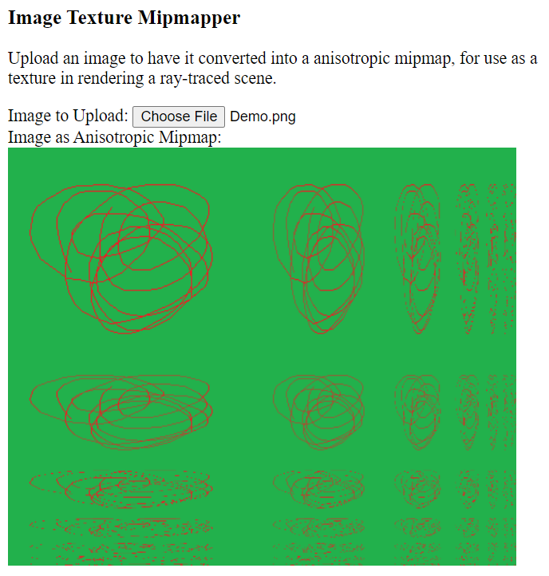

ImageTextureMipmapper
=====================

A JavaScript utility that converts an uploaded texture image into a
MIP map, or "mipmap".

The acronym MIP stands for "multum in parvo", which is (reportedly)
Latin for "much in a small space".  MIP maps are used in computer graphics
for mapping an texture image onto the surfaces of objects in a rendered scene.

Mipmaps are necessary because the size of a pixel
in an image of a rendered scene may not, when projected onto a texture image,
closely match that of the size of a pixel in the texture image.
This is especially true when the surface being rendered is far from the camera,
or when it is sharply inclined to the direction the camera is pointing.

Thus, a single pixel in the rendered scene may correspond to a large region
of pixels on the texture, and so two pixels which are adjacent in the rendered scene
may represent two regions of texture pixels whose corresponding parts,
such as centers or upper-left corners, are widely separated.
If only a single pixel from the texture (sometimes called a "texel") were selected
for each of the pixels in the rendered scene, the scene pixel would likely not be
representative of the average color of the pixels in the region of texture pixels
onto which the scene pixel is projected.  This negatively impacts the accuracy and realism
of the rendered scene.  This problem might manifest as strang "artifacts" on the rendered
scene, or may even make it impossible to recognize that a given texture was meant to be
applied to a given region of scene pixels at all.  This phenomenon is called "aliasing",
or simply sampling error.

One could perhaps solve this problem by determining exactly which pixels on the texture
correspond to the scene pixel, and averaging their colors together.  However,
this might be a very computationally expensive operation to do for every pixel in a scene.

Mipmaps solve the aliasing problem by pre-computing scaled-down versions of the texture image,
and storing them alongside the original texture, perhaps as a single larger image.
When the surface to which the texture is to be applied is relatively close to
the camera, the largest subimage from the mipmap will be used.  When the surface is
far enough away from the camera that the size of a pixel from the rendered scene
corresponds to, say, the size of a 2x2 region of pixels from the texture map,
then a version of the texture image scaled to half its original dimensions is used
instead of the full-sized one.  Every time the distance from the camera doubles,
a texture image scaled to half the size of the previous one is used.  The result
is that the scene pixel's color more closely matches the average color of the
corresponding texture pixels.

For surfaces that are sharply inclined to the camera, rather than scaling both the width
and height of the texture image by the same factor, it may be more helpful
to scale them by different factors.  This is called "anisotropy", which is either Latin
or Greek for "not the same direction-ness".  An example of anisotropy is if the camera
is peering along a brick wall whose closest part is near to the camera
but which faces in a direction nearly but not quite perpindicular to the direction
the camera is pointing.  In such a case, a subimage of the mipmap might be chosen
that has the same height as the original texture image, but only, say, a quarter of
its height.  If the wall is long enough, many distinct subimages of the mipmap may be used
to render it, and likely most will have the same ratio of width to height.